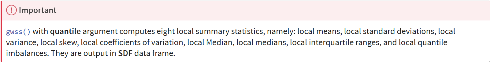

# **Geographically Weighted Summary Statistics - gwModel methods**

### **Overview**

-   **Geographically Weighted Summary Statistics (GWSS)** are methods that calculate summary statistics (like mean, standard deviation, or median) for local areas within a dataset, rather than for the entire dataset globally.

-   Each calculation assigns weights to nearby data points, with closer points receiving higher weights, using a specified kernel function (e.g., bisquare or Gaussian) and bandwidth to define the neighborhood’s influence. This allows for the detection of spatial heterogeneity, where statistical relationships and patterns vary across the study area, providing more detailed and localized insights than traditional global statistics.

**Application of GWSS**

-   GWSS are applied to understand how relationships between variables vary across geographic space in fields like environmental science, health, and socio-economics.

-   Applications include analyzing spatial variations in ecological processes, mapping health disparities, assessing the relationship between human activities and landscape changes, and identifying spatial patterns in geochemical anomalies.

-   By creating local models instead of a single global one, GWSS reveals localized relationships and spatial non-stationarity, leading to more targeted resource management and policy interventions.

**Learning Outcome**

By the end of this in-class exercise, you will gain hands-on experience in

-   extracting and preparing geospatial analytics data by using appropriate fiunctions of **sf**, **readr** and **dplyr** packages.

-   computing geographically weighted summaries statistics and correlation coefficients by using `gwss()` of **GWmodel** package,

-   extracting, creating and integrating SDF data frame of gwss object with hunan sf data frame by using appropriate **dplyr** functions, and

-   visualising the output of `gwss()` using appropriate choropleth mapping functions of **tmap** package.

### **Loading the package**

To complete this exercise, sf, spdep, tmap, tidyverse, knitr and GWmodel will be used.

```{r}
pacman::p_load(sf, ggstatsplot, tmap, tidyverse, knitr, GWmodel)
```

### **Preparing the Data**

For this in-class exercise, Hunan shapefile and Hunan_2012 data file will be used.

```{r}
hunan_sf <- st_read(dsn = "data/geospatial", 
                 layer = "Hunan")
```

```{r}
hunan2012 <- read_csv("data/aspatial/Hunan_2012.csv")
```

```{r}
hunan_sf <- left_join(hunan_sf, hunan2012) %>%
  select(1:3, 7, 15, 16, 31, 32)
```

### **Mapping GDPPC**

```{r}
basemap <- tm_shape(hunan_sf) +
  tm_polygons() +
  tm_text("NAME_3", size=0.5)

gdppc <- qtm(hunan_sf, "GDPPC")
tmap_arrange(basemap, gdppc, asp=1, ncol=2)
```

**Converting to SpatialPolygonDataFrame**

```{r}
hunan_sp <- hunan_sf %>% as_Spatial()
```

### **Geographically Weighted Summary Statistics (GSWW) with adaptive bandwidth**

**Determine adaptive bandwidth**

```{r}
#Cross-validation
bw_CV <- bw.gwr(GDPPC ~ 1, 
             data = hunan_sp,
             approach = "CV",
             adaptive = TRUE, 
             kernel = "bisquare", 
             longlat = TRUE)
```

```{r}
#AIC
bw_AIC <- bw.gwr(GDPPC ~ 1, 
             data = hunan_sp,
             approach ="AIC",
             adaptive = TRUE, 
             kernel = "bisquare", 
             longlat = TRUE)
```

```{r}
bw_CV
bw_AIC
```

**Computing geographically wieghted summary statistics**

The code chunk below computes geographically weighted summary statistics by using `gwss()` of GWmodel package. The analysis is performed using adaptive distance weighted. The distance is derived using AIC method and the kernel method used id bisquare.

```{r}
gwstat <- gwss(data = hunan_sp,
               vars = "GDPPC",
               bw = bw_AIC,
               kernel = "bisquare",
               quantile = TRUE,
               adaptive = TRUE,
               longlat = TRUE)
```

**Preparing the output data**



Code chunk below is used to extract **SDF** data table from **gwss** object output from `gwss()` for subsequent geovilisation. It will be converted into data.frame by using `as.data.frame()`.

```{r}
gwstat_df <- as.data.frame(gwstat$SDF)
```

Next, `cbind()` is used to append the newly derived data.frame onto *hunan_sf* sf data.frame.

```{r}
hunan_gstat <- cbind(hunan_sf, gwstat_df)
```

**Visualising geographically weighted summary statistics**

```{r}
tm_shape(hunan_gstat) +
  tm_polygons(fill = "GDPPC_LM",
              fill.scale = tm_scale_intervals(
                style = "quantile",
                n = 5,
                values = "brewer.blues"),
              fill.legend = tm_legend(
                title = "local Mean")) +
  tm_borders(fill_alpha = 0.5) +
  tm_layout(main.title = "Distribution of geographically wieghted mean",
            main.title.position = "center",
            main.title.size = 2.0,
            frame = TRUE)
```

### **GWSS with Fixed Bandwidth**

**Determine fixed bandwidth**

```{r}
#Cross-validation
bw_CV_fixed <- bw.gwr(GDPPC ~ 1, 
             data = hunan_sp,
             approach = "CV",
             adaptive = FALSE, 
             kernel = "bisquare", 
             longlat = TRUE)
```

```{r}
#AIC
bw_AIC_fixed <- bw.gwr(GDPPC ~ 1, 
             data = hunan_sp,
             approach ="AIC",
             adaptive = FALSE, 
             kernel = "bisquare", 
             longlat = TRUE)
```

```{r}
bw_CV_fixed
bw_AIC_fixed
```

**Computing adaptive bandwidth GWSS**

```{r}
gwstat_fixed <- gwss(data = hunan_sp,
               vars = "GDPPC",
               bw = bw_AIC_fixed,
               kernel = "bisquare",
               adaptive = FALSE,
               quantile = FALSE,
               longlat = TRUE)
```

**Preparing the output data**

```{r}
gwstat_fixed_df <- as.data.frame(gwstat_fixed$SDF)
```

```{r}
hunan_gstat_fixed <- cbind(hunan_sf, gwstat_fixed_df)
```

**Visualising geographically weighted summary statistics**

```{r}
tm_shape(hunan_gstat_fixed) +
  tm_polygons(fill = "GDPPC_LM",
              fill.scale = tm_scale_intervals(
                style = "quantile",
                n = 5,
                values = "brewer.blues"),
              fill.legend = tm_legend(
                title = "local Mean")) +
  tm_borders(fill_alpha = 0.5) +
  tm_layout(main.title = "Distribution of geographically wieghted mean",
            main.title.position = "center",
            main.title.size = 2.0,
            frame = TRUE)
```

### **Geographically Weighted Correlation**

Business question: Is there any relationship between GDP per capita and Gross Industry Output?

**Conventional Statistical Solution**

```{r}
ggscatterstats(
  data = hunan2012, 
  x = Agri, 
  y = GDPPC,
  xlab = "Gross Agriculture Output", ## label for the x-axis
  ylab = "GDP per capita", 
  label.var = County, 
  label.expression = Agri > 10000 & GDPPC > 50000, 
  point.label.args = list(alpha = 0.7, size = 4, color = "grey50"),
  xfill = "#CC79A7", 
  yfill = "#009E73", 
  title = "Relationship between GDP PC and Gross Agriculture Output")
```

**Geospatial analytics solution**

Determine bandwidth

```{r}
bw <- bw.gwr(GDPPC ~ GIO, 
             data = hunan_sp, 
             approach = "AICc", 
             adaptive = TRUE)
```

Compute gwCorrelation

```{r}
gwstats <- gwss(hunan_sp, 
                vars = c("GDPPC", "GIO"), 
                bw = bw,
                kernel = "bisquare",
                adaptive = TRUE, 
                longlat = TRUE)
```

Extract the results

```{r}
gwstat_df <- as.data.frame(gwstats$SDF) %>%
  select(c(12,13)) %>%
  rename(gwCorr = Corr_GDPPC.GIO,
         gwSpearman = Spearman_rho_GDPPC.GIO)
```

```{r}
hunan_Corr <- cbind(hunan_sf, gwstat_df)
```

**Visualising Local Correlation**

```{r}
tm_shape(hunan_Corr) +
  tm_polygons(fill = "gwSpearman",
              fill.scale = tm_scale_intervals(
                style = "quantile",
                n = 5,
                values = "brewer.blues"),
              fill.legend = tm_legend(
                title = "local Spearman Rho")) +
  tm_borders(fill_alpha = 0.5) +
  tm_title("Local Spearman Rho", 
  size = 2.0) +
  tm_layout(frame = TRUE)
```
