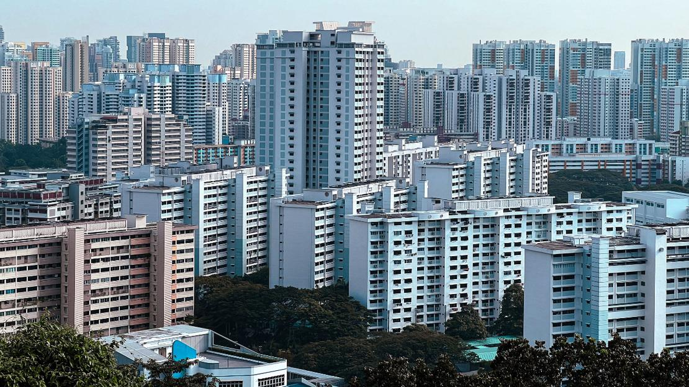

# **1 Introduction**



~[*via: PropertyGuru*]{.smallcaps}~

## 1.1 Overview

Housing represents one of the most significant forms of wealth in Singapore, and the resale market for Housing and Development Board (HDB) flats plays a vital role in determining household mobility and affordability. The resale price of an HDB flat is influenced by many factors: both structural (e.g., floor area, lease balance, floor level) and locational (e.g., accessibility to public transport, proximity to schools, parks, etc).

Traditional regression models such as **Ordinary Least Squares (OLS)** have been widely used to explain variations in housing prices. However, housing transactions are inherently spatial, as nearby units often share similar price due to spatial dependence or location effects. As a result, OLS models may lead to biased or inefficient estimates.

## 1.2 Objective

This exercise aims to develop a **spatially informed model** that identifies and evaluates the factors influencing **HDB 4-room resale flat prices** in Singapore between **1 January 2025 and 30 September 2025**. Specifically, we to address the following questions:

-   Which structural and locational factors significantly influence 4-room HDB resale prices?

-   How do these relationships vary spatially across different neighbourhoods in Singapore?

-   Does the geographically weighted approach provide better model performance compared to traditional OLS regression?

# **2. Getting Started**

## **2.1 The Packages**

In this exercise, we will use following packages:

| Package | Description |
|------------------------------------|------------------------------------|
| [**sf**](https://r-spatial.github.io/sf/) | Provides functions to manage, processing, and manipulate **Simple Features**, a formal geospatial data standard that specifies a storage and access model of spatial geometries such as points, lines, and polygons. |
| [**tidyverse**](https://www.tidyverse.org/) | Provides collection of functions for performing data science task such as importing, tidying, wrangling data and visualising data. |
| [**tmap**](https://cran.r-project.org/web/packages/tmap/) | Provides functions for plotting cartographic quality static point patterns maps or interactive maps by using [leaflet](https://leafletjs.com/) API. |
| [**sfdep**](https://cran.r-project.org/web/packages/sfdep/index.html) | An interface to ‘spdep’ to integrate with ‘sf’ objects and the ‘tidyverse’. |
| [**spdep**](https://cran.r-project.org/web/packages/spdep/index.html) | A collection of functions to create spatial weights matrix objects from polygon ‘contiguities’ |
| [**knitr**](https://cran.r-project.org/web/packages/knitr/index.html) | Provides a general-purpose tool for dynamic report generation in R using Literate Programming techniques. |
| [**rvest**](https://cran.r-project.org/web/packages/rvest/index.html) | Wrappers around the ‘xml2’ and ‘httr’ packages to make it easy to download, then manipulate, HTML and XML. |
| [**ggplot2**](https://ggplot2.tidyverse.org/) | Provides graphics plots and mappings. |
| [**viridis**](https://cran.r-project.org/web/packages/viridis/index.html) | Color maps designed to improve graph readability. |
| [**Kendall**](https://cran.r-project.org/web/packages/Kendall/index.html) | Kendall Rank Correlation and Mann-Kendall Trend Test. |

```{r}
pacman::p_load(httr, tidyverse, sf, tmap, jsonlite, progress, spdep, GWmodel, SpatialML, rsample, Metrics, knitr, kableExtra, spatialRF, randomForestExplainer)
```

## **2.2 Datasets**

| **Dataset Name** | **Description** | **Format** | **Source** |
|------------------|------------------|------------------|------------------|
| Passenger Volume by Origin Destination Bus Stops | Returns number of trips by weekdays and weekends from the origin to destination bus stops. | JSON/CSV | [LTA DataMall](https://datamall.lta.gov.sg/content/datamall/en.html) |
| Bus Stop Location | A point representation to indicate the position where buses should stop to pick up or drop off passengers. | SHP | [LTA DataMall](https://datamall.lta.gov.sg/content/datamall/en.html) |
| Singapore Master Plan 2019 (URA) Zoning Data | Singapore’s land-use zones: residential, commercial, mixed-use, industrial. | KML | [data.gov.sg](https://data.gov.sg/datasets/d_8594ae9ff96d0c708bc2af633048edfb/view) |

## **2.3 Importing datasets to R environment**

**Importing HDB Resale Price Dataset**

The data set comprises of HDB resale transactions from Jan 2017 onwards. For the purpose of this exercise, the code chunk below will be used to extract a sub-set of transaction records on 4-Room flat transacted from **1 January 2025 to 30 September 2025**.

```{r}
HDBresale <- read_csv("data/aspatial/HDBresale.csv") %>%
  filter(flat_type == "4 ROOM") %>%
  filter(month >= "2025-01" & month < "2025-10")
```

In Singapore, sometimes "St" comes at the beginning of the street name and stands for "Saint", meanwhile those "St" at the end are "Street". To avoid complications, we will rename those street names with "St" at the beginning to the full "Saint".

```{r}
HDBresale$street_name <- gsub (
  "ST\\.", "SAINT",
  HDBresale$street_name
)
```

**Geocoding HDB resale data**

We prepare a geocoding function by using the code chunk below. It aims to perform the following tasks:

-   Combining the block and street name into an address. The addresses will be used to geocode instead of postal code,

-   Passing the address as the **searchVal** in our query,

-   Sending the query to **OneMapSG search**. Note: Since we don’t need all the address details, we can set getAddrDetails as ‘N’,

-   Converting response (JSON object) to text,

-   Saving response in text form as a dataframe, and

-   Retain the latitude and longitude for our output.

```{r, eval=FALSE}
#| eval: false
geocode <- function(block, streetname) {
  base_url <- "https://onemap.gov.sg/api/common/elastic/search"
  address <- paste(block, streetname, sep = " ")
  query <- list("searchVal" = address,
                "returnGeom"= "Y",
                "getAddrDetails" = "N",
                "pageNum" = "1")
  
  res <- GET(base_url, query = query)
  restext <- content(res, as="text")
  
  output <- fromJSON(restext) %>%
    as.data.frame %>%
    select(results.LATITUDE, results.LONGITUDE)
  
  return(output)
}
```

```{r, eval=FALSE}
#| eval: false
HDBresale$LATITUDE <- 0
HDBresale$LONGITUDE <- 0

for(i in 1:nrow(HDBresale)){
  temp_output <- geocode(HDBresale[i, 4], HDBresale[i, 5])
  
  HDBresale$LATITUDE[i] <- temp_output$results.LATITUDE
  HDBresale$LONGITUDE[i] <- temp_output$results.LONGITUDE
  
}
```

After retrieving the lat/long output, we convert them into sf object with location coordinates, and set projected coordinates system to SVY21.

```{r, eval=FALSE}
HDBresale_sf <- HDBresale %>% 
  st_as_sf(coords = c("LONGITUDE", "LATITUDE"), crs = 4326) %>% 
  st_transform(crs = 3414)
```

We save the HDBresale sf object and csv files so that we do not need to redo previous time-consuming steps. It also helps for later use.

```{r, eval=FALSE}
saveRDS(HDBresale_sf, "data/rds/HDBresale_sf.rds")
write_csv(HDBresale, "data/rds/HDBresale_1.csv")
```

```{r, echo=FALSE}
HDBresale_sf <- read_rds("data/rds/HDBresale_sf.rds")
HDBresale <- read_csv("data/rds/HDBresale_1.csv")
```

Exploratory Data Analysis

We can plot the distribution of *resale_price* by using *ggplot* as shown in the code chunk below.

```{r}
ggplot(data=HDBresale_sf, 
       aes(x=`resale_price`)) +
  geom_histogram(bins=20, 
                 color="black", 
                 fill="light blue")
```

::: callout-note
The histogram shows that **4-room HDB resale prices are right-skewed**, with the majority of transactions clustered between **SGD 400,000 and SGD 700,000**.

-   The **peak** lies around **SGD 550,000**, indicating that most resale transactions occur within this mid-range.

-   There is a **long tail extending beyond SGD 1 million**, reflecting a smaller number of high-value flats (likely in **central or mature estates** e.g., Bishan, Toa Payoh, Queenstown).

-   The **positive skewness** suggests that while most 4-room flats remain moderately priced, a minority of premium locations or newly upgraded flats significantly increase the upper price range.

Overall, this distribution highlights a **heterogeneous housing market** - dominated by mid-priced units but with a clear presence of high-end resale transactions in desirable areas.
:::

We will import Singapore Master Plan 2019 Zoning Data (reused from Take-home Ex2) and have an overview of HDB resales and pricing distribution on the map.

```{r fig.width=8, fig.height=8, out.width="100%", dpi=300}
mpsz <- read_rds("data/rds/mpsz.rds")

tmap_mode("plot")
tm_shape(mpsz)+
  tm_polygons() +
tm_shape(HDBresale_sf) +  
  tm_dots(fill = "resale_price",
          fill_alpha = 0.6,
          size = 0.5,
          fill.scale = tm_scale_intervals(
            style="quantile")) 
```

::: callout-note
HDB resale activities are unevenly distributed across Singapore. Clusters of frequent resales are observed in **mature housing estates**, particularly in:

-   Central-north areas (e.g. Ang Mo Kio, Toa Payoh, Bishan).

-   Tampines and Bedok - dense eastern estates.

-   Jurong West and Bukit Batok - large western residential zones.

In contrast, fewer resale transactions are seen in newer or smaller estates such as Punggol, Sengkang, and Bukit Panjang.

In term of pricing:

-   Higher resale prices (dark blue) are concentrated in **central and mature estates** (eg *Bishan*, *Toa Payoh*, *Queenstown*, parts of *Kallang/Whampoa)*.

-   Lower resale prices (light blue) are in **northern and northeastern towns** (eg *Woodlands*, *Yishun*, *Punggol*, and *Sengkang)*.

Overall, the map suggests a clear price gradient decreasing outward from the Central Region, illustrating how **location** and **accessibility** continue to drive HDB resale values.
:::

```{r}
HDBclean <- HDBresale %>%
  mutate(
    storey_low = as.numeric(str_extract(storey_range, "^[0-9]+")),
    storey_high = as.numeric(str_extract(storey_range, "[0-9]+$")),
    floor_level = (storey_low + storey_high) / 2
  ) %>%
  mutate(
    remaining_lease_yrs = as.numeric(str_extract(remaining_lease, "^[0-9]+")),
    remaining_lease_mths = as.numeric(str_extract(remaining_lease, "(?<=years )[0-9]+")),
    remaining_lease_mths = ifelse(is.na(remaining_lease_mths), 0, remaining_lease_mths),
    remaining_lease_yrs = remaining_lease_yrs + remaining_lease_mths / 12
  ) %>%
  mutate(flat_age = 2025 - lease_commence_date)
```

```{r}
HDBclean1 <- HDBclean %>%
  select(-storey_range, 
         -remaining_lease,
         -lease_commence_date,
         -storey_low, 
         -storey_high, 
         -remaining_lease_mths)
```

```{r}
HDBclean1_sf <- HDBclean1 %>% 
  st_as_sf(coords = c("LONGITUDE", "LATITUDE"), crs = 4326) %>% 
  st_transform(crs = 3414)
```

```{r}
preschool = st_read("data/geospatial/PreSchoolsLocation.kml") %>%
  st_transform(crs = 3414)
```

```{r}
within_350m <- st_is_within_distance(
  HDBresale_sf, preschool, dist = 350)

HDBresale_sf <- HDBresale_sf %>%
  mutate(prischool_350m = map_int(within_350m, length))
```

```{r, eval=FALSE}
##save!!!
saveRDS(HDBresale_sf, "data/rds/HDBresale_sf.rds")
write_csv(HDBresale, "data/rds/HDBresale_updated.csv")
```
